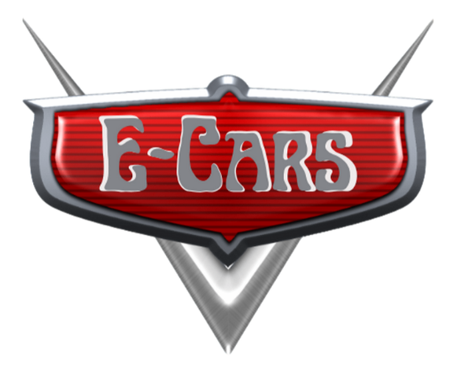

# Proyecto Web E-Cars

## Título y Descripción del Proyecto
**Título:** E-Cars - Web para compra y venta de Vehículos.
  
**Descripción:** Desarrollo de un sitio web para el concesionario de vehículos E-Cars, facilitando la venta de autos usados y la compra de autos nuevos y usados. El sitio permitirá a los usuarios completar formularios para vender sus vehículos, acceder a catálogos de autos disponibles y obtener información de contacto del concesionario.

## Público Objetivo
**Público:** Personas interesadas en vender sus autos usados y compradores potenciales de vehículos nuevos y usados.

## Estructura del Sitio
### Etapa Frontend
- **Inicio**: pagina principal de la web.
- **Nuevos**: muestra un catalogo de vehículos nuevos/0Km.
- **Usados**: muestra un catalogo de vehículos usados.
- **Contacto**

### Etapa Backend
- **Botón para añadir un vehículo nuevo en el navbar**
- **Formulario para añadir un nuevo vehículo**: agrega un nuevo vehículo en la base de datos de vehículos usados.
- **Formulario para añadir un modificar vehículo**:modifica los datos de un vehículo existente en la base de datos de vehículos usados.
- **Manejo de datos**: muestra un listado de todos los vehículos en la Base de datos.

## Diseño y Estilo
**Estilo Visual:** Moderno y profesional, con un enfoque en la claridad y la facilidad de uso.  

**Colores:**
- Principal:  #eb0a1e
- Secundario: #f9c22e
- Claro: #e9e2cf
- Oscuro: #0c090d

**Tipografía:**
- Rubik Mono One para títulos y subtítulos.
- Quicksand para textos y párrafos.

## Contenido y Funcionalidades
**Contenido:**
- Texto informativo sobre los servicios ofrecidos.
- Catálogo con imágenes de vehículos disponibles.
- Formularios de contacto y venta de vehículos.

**Funcionalidades:**
- Catálogo de vehículos nuevos y usados disponibles.
- Formulario interactivo para la venta de vehículos.
- Información de contacto y horario de atención.

## Responsabilidades del Equipo
**Equipo:**
- **Omar Orue:** Desarrollo del catálogo de vehículos usados.
- **Nahuel Romera:** Desarrollo de la página de inicio, navbar y footer.
- **Adolfo Lujan:** Desarrollo del catálogo de vehículos nuevos.
- **Luciano Angeleri:** Desarrollo de la página de contacto.

## Cronograma Tentativo
- **Diseño y planificación:** 1 semana 
- **Desarrollo y programación:** 3 semanas 
- **Testeo:** 1 semana 

## Recursos Externos
- **Bootstrap:** Para la estructura y diseño responsivo.
- **API de Google Maps:** Para mostrar la ubicación del concesionario.
- **Font Awesome:** Para iconos vectoriales.
- **Flask:** Framework web para el backend.
- **MySQL:** Sistema de gestión de base de datos.
- **PyMySQL:** Conector de Python para MySQL.
- **Jinja2:** Motor de plantillas para Python.

## Funcionamiento del Backend

El backend está desarrollado en Flask y utiliza MySQL como base de datos. Las principales funcionalidades incluyen:

1. **Conexión a la base de datos**: Mediante el archivo `db.py`.
2. **Operaciones CRUD**: Implementadas en `controller_db.py`.
3. **Validaciones**: Realizadas a través de `validaciones.py`.
4. **Rutas y lógica de la aplicación**: Definidas en `app.py`.

## Cómo probar el CRUD de Vehículos

1. **Crear (Create)**: 
   - Accede a "/nuevoVehiculo" para mostrar el formulario de nuevo vehículo.
   - Completa el formulario y envía los datos.
   - Verifica la adición en "/manejoDatos" o "/pruebaCatVehiculos".

2. **Leer (Read)**:
   - Visita en "/manejoDatos" o "/pruebaCatVehiculos" para ver todos los vehículos.
   - Usa "/catalogoUsados/<tipo>" para filtrar por tipo de vehículo.
   **NOTA:**Al no estar implementado todavía el sistema de guardado de imágenes, es posible que no se muestren adecuadamente algunas imágenes. Ciertas imágenes fueron cargadas previamente en la carpeta "static/". Los nuevos vehículos cargados por el formulario utilizan un input para cargar las imágenes mediante una ruta URL y esta se guarda en la base de datos. Es por esta diferencia en la carga de de archivos y como se acceden a las rutas de las imágenes en los templates que se origina este problema.

4. **Actualizar (Update)**:
   - Ve a "/manejoDatos" y selecciona "Editar" en el vehículo deseado.
   - Modifica los datos en el formulario y guarda los cambios.

5. **Eliminar (Delete)**:
   - En "/manejoDatos", elige "Borrar" para el vehículo que deseas eliminar.

## Mejoras Futuras

1. Normalizar y mejorar la base de datos existente e implementar una base de datos para vehículos nuevos.
2. Creación de usuarios y permisos para dar acceso al CRUD de los vehículos.
3. Mejor integración con los elementos de Frontend.
4. Validación para todos los formularios.
5. Alertas o avisos en el proceso de CRUD para informar al usuario.
6. Terminar de implementar por completo un sistema de búsqueda y filtrado avanzado para los vehículos.
7. Mejorar el formulario de carga de vehículos para permitir la subida directa de imágenes en lugar de usar URLs.
8. Implementar un sistema de paginación para el catálogo de vehículos.
9. Añadir un panel de administración más completo para gestionar todos los aspectos del sitio.

## Contacto
- **Omar Orue:**
    - Email: omar.orue@live.com.ar
    - Github: https://github.com/omarorue
- **Nahuel Romera:**
    - Email: nahuelr93@gmail.com
    - Github: https://github.com/NahuelRomera
- **Adolfo Lujan:**
    - Email: adolfoglujan@gmail.com
    - Github: https://github.com/aglujan89
    - LinkedIn: https://www.linkedin.com/in/adolfo-lujan/
- **Luciano Angeleri:** 
    - Email: lcnang@gmail.com
    - Github: https://github.com/LucianoAngeleri
    - LinkedIn: https://www.linkedin.com/in/cesar-luciano-angeleri/

## Fecha de Entrega
**Fecha de Entrega del Proyecto - Etapa Frontend :** 17 de Mayo 2024
**Fecha de Entrega del Proyecto - Etapa Backend:** 11 de Julio 2024
